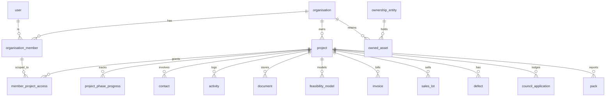

# GABE — Database Design

> Target: **PostgreSQL 15+**. This schema turns the GABE frontend prototype (currently all mocked) into a
> real, multi-tenant SaaS backend. Every table maps to a module in `src/data/` / `src/components/`.
> Prepared 2026-06-07.

---

## 1. Design principles

| Principle | Decision |
|---|---|
| **Multi-tenant** | Every business-data row carries `org_id`. One developer business = one `organisation`. Tenants are isolated by Row-Level Security (§9). |
| **Identity vs membership** | A `user` is a global login; an `organisation_member` joins a user to an org with a `role`. A user can belong to several orgs. |
| **Project-scoped RBAC** | A supervisor sees only their sites. Modelled with `member_project_access` + an `all_projects` flag. Mirrors `canAccessProject()` in the app. |
| **UUID keys** | `uuid` PKs (`gen_random_uuid()`), so ids are non-guessable and safe to expose in URLs. |
| **Soft delete + audit** | `created_at`/`updated_at` everywhere (trigger-maintained); `deleted_at` on user-mutable tables; full `audit_log`. |
| **Money** | `numeric(14,2)` (AUD). Never floats. |
| **Files** | Binary lives in object storage (S3/Spaces); DB stores a `storage_key`. One generic `document` + `document_version` model, attachable to any record via `document_link` (§5). |
| **Enums** | Postgres `ENUM` types for closed sets; `text` only for open-ended fields. |
| **Time** | `timestamptz` (UTC). Plain `date` for calendar-only fields (due dates, settlement). |
| **Extensibility** | A `jsonb metadata` escape hatch on the heavy tables for prototype-stage fields without migrations. |

---

## 2. Domain map

```
Tenancy & Identity   organisation, user, organisation_member, member_project_access, role_portal
Projects             project, project_phase_progress, project_insight
People & Comms       contact, activity, note, phase_task
Documents            document, document_version, document_link
Feasibility & Finance feasibility_model, feasibility_line, feasibility_cashflow,
                     feasibility_sensitivity, invoice, variation
Construction         checklist_template(+stage,+item), project_checklist_status,
                     inspection, ohs_document, defect, rfi, progress_photo
Sales                buyer, sales_lot, sales_contract
Statutory            council_application, utility_connection, consultant_report, legal_document
Assets               ownership_entity, owned_asset, asset_valuation, asset_loan
Investor             pack, pack_section, pack_share, capital_request
Automation & Intgr.  integration_connection, email_ingestion, ai_job, automated_activity
Platform             audit_log
```

### High-level ER (core)



---

## 3. Enum types

```sql
CREATE TYPE member_role        AS ENUM ('executive','developer','supervisor','asset_manager','investor');
CREATE TYPE portal             AS ENUM ('dashboard','feasibility','construction','asset','investor','planner','agentic');
CREATE TYPE project_type       AS ENUM ('townhouse','tower','subdivision');
CREATE TYPE project_phase      AS ENUM ('site_identification','feasibility','financing','presales',
                                        'land_acquisition','architecture','planning_permit',
                                        'construction','marketing','sales');
CREATE TYPE health_status      AS ENUM ('on_track','at_risk','critical');
CREATE TYPE insight_category   AS ENUM ('risk','opportunity','action');
CREATE TYPE activity_type      AS ENUM ('email_in','email_out','phone_in','phone_out','sms_in','sms_out');
CREATE TYPE task_status        AS ENUM ('not_started','in_progress','done');
CREATE TYPE task_source        AS ENUM ('system','user');
CREATE TYPE doc_category       AS ENUM ('architectural','working_drawings','consultant_report','legal',
                                        'permit','utility','ohs','sales','asset','photo','other');
CREATE TYPE invoice_status     AS ENUM ('captured','pending','approved','paid','rejected');
CREATE TYPE invoice_source     AS ENUM ('email','manual','integration');
CREATE TYPE variation_status   AS ENUM ('pending','approved','rejected');
CREATE TYPE inspection_status  AS ENUM ('pending','passed','failed');
CREATE TYPE ohs_type           AS ENUM ('swms','msds','workcover','induction','white_card','insurance');
CREATE TYPE defect_status      AS ENUM ('open','sent','signed_off');
CREATE TYPE rfi_status         AS ENUM ('awaiting','responded');
CREATE TYPE lot_status         AS ENUM ('available','reserved','under_contract','settled');
CREATE TYPE ownership_type     AS ENUM ('personal','company','trust','smsf');
CREATE TYPE pack_type          AS ENUM ('lender','investor','jv');
CREATE TYPE pack_status        AS ENUM ('draft','ready','shared');
CREATE TYPE capital_status     AS ENUM ('identified','in_discussion','term_sheet','committed');
CREATE TYPE council_status     AS ENUM ('not_lodged','lodged','rfi','approved');
CREATE TYPE utility_kind       AS ENUM ('electricity','water','gas');
CREATE TYPE utility_status     AS ENUM ('not_applied','applied','approved','energised','connected');
CREATE TYPE report_status      AS ENUM ('not_received','draft','final','superseded');
CREATE TYPE legal_section      AS ENUM ('acquisition','planning','construction','sales');
CREATE TYPE integration_kind   AS ENUM ('xero','myob','quickbooks','gmail','outlook','google_drive',
                                        'sharepoint','onedrive','twilio','realestate');
CREATE TYPE ingestion_status   AS ENUM ('received','classified','matched','actioned','ignored');
CREATE TYPE ai_job_kind        AS ENUM ('draft_email','analyse_document','call_summary','agent_action','classify_email');
CREATE TYPE ai_job_status      AS ENUM ('queued','running','succeeded','failed');
```

---

## 4. Tenancy, identity & access

```sql
CREATE TABLE organisation (
  id          uuid PRIMARY KEY DEFAULT gen_random_uuid(),
  name        text NOT NULL,
  abn         text,
  created_at  timestamptz NOT NULL DEFAULT now(),
  updated_at  timestamptz NOT NULL DEFAULT now()
);

CREATE TABLE "user" (
  id             uuid PRIMARY KEY DEFAULT gen_random_uuid(),
  email          citext UNIQUE NOT NULL,
  full_name      text NOT NULL,
  password_hash  text,                 -- null when SSO-only
  last_login_at  timestamptz,
  created_at     timestamptz NOT NULL DEFAULT now(),
  updated_at     timestamptz NOT NULL DEFAULT now()
);

-- A user's seat in an organisation, carrying their role.
CREATE TABLE organisation_member (
  id            uuid PRIMARY KEY DEFAULT gen_random_uuid(),
  org_id        uuid NOT NULL REFERENCES organisation(id) ON DELETE CASCADE,
  user_id       uuid NOT NULL REFERENCES "user"(id) ON DELETE CASCADE,
  role          member_role NOT NULL,
  all_projects  boolean NOT NULL DEFAULT false,   -- true = sees every project in org
  created_at    timestamptz NOT NULL DEFAULT now(),
  updated_at    timestamptz NOT NULL DEFAULT now(),
  deleted_at    timestamptz,
  UNIQUE (org_id, user_id)
);

-- Project-scoped access for members where all_projects = false (e.g. supervisors).
CREATE TABLE member_project_access (
  member_id   uuid NOT NULL REFERENCES organisation_member(id) ON DELETE CASCADE,
  project_id  uuid NOT NULL REFERENCES project(id) ON DELETE CASCADE,
  PRIMARY KEY (member_id, project_id)
);

-- Which portals each role may open (drives the nav + RequirePortal guard).
CREATE TABLE role_portal (
  org_id  uuid NOT NULL REFERENCES organisation(id) ON DELETE CASCADE,
  role    member_role NOT NULL,
  portal  portal NOT NULL,
  PRIMARY KEY (org_id, role, portal)
);
```

> **Access resolution** (mirrors `roles.ts`): a member can see a project when `all_projects` OR a row in
> `member_project_access`. A member can open a portal when `(org_id, role, portal)` exists in `role_portal`.

---

## 5. Documents (generic, attachable)

One model serves every "file" in the app (plans, legal docs, certificates, OH&S, photos, rental statements).

```sql
CREATE TABLE document (
  id             uuid PRIMARY KEY DEFAULT gen_random_uuid(),
  org_id         uuid NOT NULL REFERENCES organisation(id) ON DELETE CASCADE,
  project_id     uuid REFERENCES project(id) ON DELETE CASCADE,   -- null = org-level (e.g. asset docs)
  category       doc_category NOT NULL DEFAULT 'other',
  name           text NOT NULL,
  current_version_id uuid,             -- FK set after first version (deferred)
  uploaded_by    uuid REFERENCES organisation_member(id),
  created_at     timestamptz NOT NULL DEFAULT now(),
  updated_at     timestamptz NOT NULL DEFAULT now(),
  deleted_at     timestamptz
);

CREATE TABLE document_version (
  id            uuid PRIMARY KEY DEFAULT gen_random_uuid(),
  document_id   uuid NOT NULL REFERENCES document(id) ON DELETE CASCADE,
  version_label text NOT NULL,         -- 'v1','v2'
  storage_key   text NOT NULL,         -- object-store path; binary never in DB
  mime_type     text,
  size_bytes    bigint,
  note          text,
  uploaded_by   uuid REFERENCES organisation_member(id),
  created_at    timestamptz NOT NULL DEFAULT now(),
  UNIQUE (document_id, version_label)
);
ALTER TABLE document
  ADD CONSTRAINT document_current_version_fk
  FOREIGN KEY (current_version_id) REFERENCES document_version(id);

-- Polymorphic attachment: link one document to any record (defect photo, legal contract, etc.).
-- No DB-level FK on (linked_type, linked_id) — integrity enforced in the app / a trigger.
CREATE TABLE document_link (
  document_id  uuid NOT NULL REFERENCES document(id) ON DELETE CASCADE,
  linked_type  text NOT NULL,          -- 'defect','inspection','legal','consultant_report','asset','sales_contract',...
  linked_id    uuid NOT NULL,
  role         text,                   -- e.g. 'before','after','certificate','endorsed_plan'
  PRIMARY KEY (document_id, linked_type, linked_id)
);
CREATE INDEX ON document_link (linked_type, linked_id);
```

---

## 6. Projects, people, comms

```sql
CREATE TABLE project (
  id                    uuid PRIMARY KEY DEFAULT gen_random_uuid(),
  org_id                uuid NOT NULL REFERENCES organisation(id) ON DELETE CASCADE,
  name                  text NOT NULL,
  address               text,
  suburb                text,
  state                 text,                    -- VIC/NSW/QLD/SA/WA
  type                  project_type NOT NULL,
  abn                   text,
  total_units           integer,
  estimated_value       numeric(14,2),           -- GDV
  start_date            date,
  estimated_completion  date,
  health_status         health_status,
  health_reason         text,
  description           text,
  metadata              jsonb NOT NULL DEFAULT '{}',
  created_at            timestamptz NOT NULL DEFAULT now(),
  updated_at            timestamptz NOT NULL DEFAULT now(),
  deleted_at            timestamptz
);

CREATE TABLE project_phase_progress (
  project_id  uuid NOT NULL REFERENCES project(id) ON DELETE CASCADE,
  phase       project_phase NOT NULL,
  pct         smallint NOT NULL CHECK (pct BETWEEN 0 AND 100),
  PRIMARY KEY (project_id, phase)
);

CREATE TABLE project_insight (
  id          uuid PRIMARY KEY DEFAULT gen_random_uuid(),
  project_id  uuid NOT NULL REFERENCES project(id) ON DELETE CASCADE,
  category    insight_category NOT NULL,
  text        text NOT NULL,
  generated_by_ai boolean NOT NULL DEFAULT true,
  created_at  timestamptz NOT NULL DEFAULT now()
);

CREATE TABLE contact (
  id            uuid PRIMARY KEY DEFAULT gen_random_uuid(),
  org_id        uuid NOT NULL REFERENCES organisation(id) ON DELETE CASCADE,
  project_id    uuid REFERENCES project(id) ON DELETE CASCADE,  -- null = org-wide contact
  full_name     text NOT NULL,
  organisation_name text,
  role_title    text,
  phone         text,
  email         citext,
  is_mobile     boolean GENERATED ALWAYS AS
                  (phone ~ '^(\+?61\s?4|0?4)') STORED,
  created_at    timestamptz NOT NULL DEFAULT now(),
  updated_at    timestamptz NOT NULL DEFAULT now()
);

-- Emails, calls, SMS — inbound & outbound. Powers WIP/activity feeds.
CREATE TABLE activity (
  id           uuid PRIMARY KEY DEFAULT gen_random_uuid(),
  org_id       uuid NOT NULL REFERENCES organisation(id) ON DELETE CASCADE,
  project_id   uuid NOT NULL REFERENCES project(id) ON DELETE CASCADE,
  phase        project_phase,
  type         activity_type NOT NULL,
  contact_id   uuid REFERENCES contact(id),
  person_name  text,                     -- denormalised for display
  summary      text,
  subject      text,                     -- email only
  body         text,                     -- email/sms
  transcript   text,                     -- phone only
  occurred_at  timestamptz NOT NULL,
  ingestion_id uuid REFERENCES email_ingestion(id),  -- if auto-captured from email
  created_at   timestamptz NOT NULL DEFAULT now()
);

-- Tasks: system-generated (phase milestones) and user todos.
CREATE TABLE phase_task (
  id           uuid PRIMARY KEY DEFAULT gen_random_uuid(),
  org_id       uuid NOT NULL REFERENCES organisation(id) ON DELETE CASCADE,
  project_id   uuid NOT NULL REFERENCES project(id) ON DELETE CASCADE,
  phase        project_phase,
  title        text NOT NULL,
  status       task_status NOT NULL DEFAULT 'not_started',
  source       task_source NOT NULL DEFAULT 'user',
  due_date     date,
  assigned_to  uuid REFERENCES organisation_member(id),
  created_by   uuid REFERENCES organisation_member(id),
  created_at   timestamptz NOT NULL DEFAULT now(),
  updated_at   timestamptz NOT NULL DEFAULT now(),
  deleted_at   timestamptz
);

CREATE TABLE note (
  id           uuid PRIMARY KEY DEFAULT gen_random_uuid(),
  org_id       uuid NOT NULL REFERENCES organisation(id) ON DELETE CASCADE,
  project_id   uuid NOT NULL REFERENCES project(id) ON DELETE CASCADE,
  phase        project_phase,
  body         text NOT NULL,
  author_id    uuid REFERENCES organisation_member(id),
  created_at   timestamptz NOT NULL DEFAULT now(),
  deleted_at   timestamptz
);
```

---

## 7. Feasibility & finance

```sql
CREATE TABLE feasibility_model (
  id              uuid PRIMARY KEY DEFAULT gen_random_uuid(),
  project_id      uuid NOT NULL REFERENCES project(id) ON DELETE CASCADE,
  version         integer NOT NULL DEFAULT 1,
  is_current      boolean NOT NULL DEFAULT true,
  gdv             numeric(14,2),
  total_cost      numeric(14,2),   -- feasibility budget
  live_cost       numeric(14,2),   -- actual/committed trending to completion
  profit          numeric(14,2),
  margin_on_cost  numeric(6,2),
  margin_on_gdv   numeric(6,2),
  irr             numeric(6,2),
  equity          numeric(14,2),
  debt            numeric(14,2),
  lvr             numeric(6,2),
  created_at      timestamptz NOT NULL DEFAULT now()
);
CREATE UNIQUE INDEX one_current_feaso ON feasibility_model (project_id) WHERE is_current;

-- kind = 'cost' | 'revenue'; feasibility vs live drives the variance view.
CREATE TABLE feasibility_line (
  id            uuid PRIMARY KEY DEFAULT gen_random_uuid(),
  model_id      uuid NOT NULL REFERENCES feasibility_model(id) ON DELETE CASCADE,
  kind          text NOT NULL CHECK (kind IN ('cost','revenue')),
  label         text NOT NULL,
  feasibility   numeric(14,2) NOT NULL DEFAULT 0,
  live          numeric(14,2) NOT NULL DEFAULT 0,
  sort_order    smallint NOT NULL DEFAULT 0
);

CREATE TABLE feasibility_cashflow (
  id          uuid PRIMARY KEY DEFAULT gen_random_uuid(),
  model_id    uuid NOT NULL REFERENCES feasibility_model(id) ON DELETE CASCADE,
  period      text NOT NULL,         -- 'Q1 25'
  outflow     numeric(14,2) NOT NULL DEFAULT 0,
  inflow      numeric(14,2) NOT NULL DEFAULT 0,
  net_cumulative numeric(14,2) NOT NULL DEFAULT 0,
  sort_order  smallint NOT NULL DEFAULT 0
);

CREATE TABLE feasibility_sensitivity (
  id          uuid PRIMARY KEY DEFAULT gen_random_uuid(),
  model_id    uuid NOT NULL REFERENCES feasibility_model(id) ON DELETE CASCADE,
  scenario    text NOT NULL,
  margin      numeric(6,2),
  profit      numeric(14,2),
  irr         numeric(6,2),
  sort_order  smallint NOT NULL DEFAULT 0
);

-- One table for every invoice state (captured-from-email → pending → approved → paid).
CREATE TABLE invoice (
  id             uuid PRIMARY KEY DEFAULT gen_random_uuid(),
  org_id         uuid NOT NULL REFERENCES organisation(id) ON DELETE CASCADE,
  project_id     uuid NOT NULL REFERENCES project(id) ON DELETE CASCADE,
  provider       text NOT NULL,
  description    text,
  amount         numeric(14,2) NOT NULL,
  budget_line    text,                    -- auto-matched feasibility cost line
  status         invoice_status NOT NULL DEFAULT 'captured',
  source         invoice_source NOT NULL DEFAULT 'manual',
  is_extra       boolean NOT NULL DEFAULT false,   -- variation/extra, not in original budget
  captured_from  text,                    -- 'Email — accounts@...'
  ingestion_id   uuid REFERENCES email_ingestion(id),
  document_id    uuid REFERENCES document(id),
  received_date  date,
  due_date       date,
  approved_by    uuid REFERENCES organisation_member(id),
  approved_at    timestamptz,
  date_paid      date,
  created_at     timestamptz NOT NULL DEFAULT now(),
  updated_at     timestamptz NOT NULL DEFAULT now()
);

CREATE TABLE variation (
  id            uuid PRIMARY KEY DEFAULT gen_random_uuid(),
  org_id        uuid NOT NULL REFERENCES organisation(id) ON DELETE CASCADE,
  project_id    uuid NOT NULL REFERENCES project(id) ON DELETE CASCADE,
  ref           text NOT NULL,            -- 'VO-011'
  description   text NOT NULL,
  contractor_id uuid REFERENCES contact(id),
  amount        numeric(14,2) NOT NULL,
  status        variation_status NOT NULL DEFAULT 'pending',
  reason        text,
  raised_date   date,
  decided_by    uuid REFERENCES organisation_member(id),
  decided_at    timestamptz,
  created_at    timestamptz NOT NULL DEFAULT now(),
  UNIQUE (project_id, ref)
);
```

---

## 8. Construction Hub

```sql
-- Reusable checklist templates (e.g. the VIC 12-stage supervisor checklist). org_id null = global library.
CREATE TABLE checklist_template (
  id           uuid PRIMARY KEY DEFAULT gen_random_uuid(),
  org_id       uuid REFERENCES organisation(id) ON DELETE CASCADE,
  name         text NOT NULL,
  jurisdiction text                       -- 'VIC'
);
CREATE TABLE checklist_stage (
  id            uuid PRIMARY KEY DEFAULT gen_random_uuid(),
  template_id   uuid NOT NULL REFERENCES checklist_template(id) ON DELETE CASCADE,
  stage_number  smallint NOT NULL,
  name          text NOT NULL,
  UNIQUE (template_id, stage_number)
);
CREATE TABLE checklist_item (
  id          uuid PRIMARY KEY DEFAULT gen_random_uuid(),
  stage_id    uuid NOT NULL REFERENCES checklist_stage(id) ON DELETE CASCADE,
  label       text NOT NULL,
  sort_order  smallint NOT NULL DEFAULT 0
);

-- Which template a project uses + per-item completion.
CREATE TABLE project_checklist (
  id           uuid PRIMARY KEY DEFAULT gen_random_uuid(),
  project_id   uuid NOT NULL REFERENCES project(id) ON DELETE CASCADE,
  template_id  uuid NOT NULL REFERENCES checklist_template(id),
  UNIQUE (project_id, template_id)
);
CREATE TABLE project_checklist_status (
  project_checklist_id uuid NOT NULL REFERENCES project_checklist(id) ON DELETE CASCADE,
  item_id     uuid NOT NULL REFERENCES checklist_item(id),
  checked     boolean NOT NULL DEFAULT false,
  checked_by  uuid REFERENCES organisation_member(id),
  checked_at  timestamptz,
  PRIMARY KEY (project_checklist_id, item_id)
);

CREATE TABLE inspection (
  id              uuid PRIMARY KEY DEFAULT gen_random_uuid(),
  org_id          uuid NOT NULL REFERENCES organisation(id) ON DELETE CASCADE,
  project_id      uuid NOT NULL REFERENCES project(id) ON DELETE CASCADE,
  type            text NOT NULL,          -- 'Pre-pour slab','Frame','Pest'...
  inspector_name  text,
  organisation_name text,
  inspection_date date,
  status          inspection_status NOT NULL DEFAULT 'pending',
  certificate_doc uuid REFERENCES document(id),
  notes           text,
  created_at      timestamptz NOT NULL DEFAULT now()
);

CREATE TABLE ohs_document (
  id          uuid PRIMARY KEY DEFAULT gen_random_uuid(),
  org_id      uuid NOT NULL REFERENCES organisation(id) ON DELETE CASCADE,
  project_id  uuid NOT NULL REFERENCES project(id) ON DELETE CASCADE,
  type        ohs_type NOT NULL,
  name        text NOT NULL,
  party       text,                       -- contractor/worker the doc belongs to
  issued_date date,
  expiry_date date,
  document_id uuid REFERENCES document(id),
  created_at  timestamptz NOT NULL DEFAULT now()
);

CREATE TABLE defect (
  id             uuid PRIMARY KEY DEFAULT gen_random_uuid(),
  org_id         uuid NOT NULL REFERENCES organisation(id) ON DELETE CASCADE,
  project_id     uuid NOT NULL REFERENCES project(id) ON DELETE CASCADE,
  location       text NOT NULL,
  description    text NOT NULL,
  contractor_id  uuid REFERENCES contact(id),
  raised_date    date NOT NULL DEFAULT current_date,
  status         defect_status NOT NULL DEFAULT 'open',
  sent_at        timestamptz,
  signed_off_at  timestamptz,
  signed_off_by  uuid REFERENCES organisation_member(id),
  created_at     timestamptz NOT NULL DEFAULT now()
);
-- before/after proof photos attach via document_link(linked_type='defect', role='before'|'after')

CREATE TABLE rfi (
  id             uuid PRIMARY KEY DEFAULT gen_random_uuid(),
  org_id         uuid NOT NULL REFERENCES organisation(id) ON DELETE CASCADE,
  project_id     uuid NOT NULL REFERENCES project(id) ON DELETE CASCADE,
  subject        text NOT NULL,
  contractor_id  uuid REFERENCES contact(id),
  contractor_phone text,
  sent_date      date,
  status         rfi_status NOT NULL DEFAULT 'awaiting',
  response_date  date,
  quoted_amount  numeric(14,2),
  note           text,
  ingestion_id   uuid REFERENCES email_ingestion(id),  -- RFIs auto-saved from email
  created_at     timestamptz NOT NULL DEFAULT now()
);

CREATE TABLE progress_photo (
  id          uuid PRIMARY KEY DEFAULT gen_random_uuid(),
  org_id      uuid NOT NULL REFERENCES organisation(id) ON DELETE CASCADE,
  project_id  uuid NOT NULL REFERENCES project(id) ON DELETE CASCADE,
  stage       text,                       -- construction stage label
  caption     text,
  document_id uuid REFERENCES document(id),  -- the image
  taken_at    timestamptz,
  uploaded_by uuid REFERENCES organisation_member(id),
  created_at  timestamptz NOT NULL DEFAULT now()
);
```

---

## 9. Sales

```sql
CREATE TABLE buyer (
  id          uuid PRIMARY KEY DEFAULT gen_random_uuid(),
  org_id      uuid NOT NULL REFERENCES organisation(id) ON DELETE CASCADE,
  name        text NOT NULL,
  email       citext,
  phone       text,
  solicitor   text,
  created_at  timestamptz NOT NULL DEFAULT now()
);

CREATE TABLE sales_lot (
  id             uuid PRIMARY KEY DEFAULT gen_random_uuid(),
  org_id         uuid NOT NULL REFERENCES organisation(id) ON DELETE CASCADE,
  project_id     uuid NOT NULL REFERENCES project(id) ON DELETE CASCADE,
  lot_number     text NOT NULL,           -- 'Unit 4','Lot 12'
  beds           smallint,
  baths          smallint,
  cars           smallint,
  internal_area  numeric(8,2),            -- sqm
  list_price     numeric(14,2),
  status         lot_status NOT NULL DEFAULT 'available',
  agency         text,
  agent_id       uuid REFERENCES contact(id),
  notes          text,
  created_at     timestamptz NOT NULL DEFAULT now(),
  updated_at     timestamptz NOT NULL DEFAULT now(),
  UNIQUE (project_id, lot_number)
);

-- A contract realises a sale on a lot (off-the-plan). settled when settlement completes.
CREATE TABLE sales_contract (
  id                uuid PRIMARY KEY DEFAULT gen_random_uuid(),
  lot_id            uuid NOT NULL REFERENCES sales_lot(id) ON DELETE CASCADE,
  buyer_id          uuid REFERENCES buyer(id),
  sale_price        numeric(14,2) NOT NULL,
  deposit_amount    numeric(14,2),
  deposit_paid_date date,
  contract_date     date,
  settlement_due    date,
  settled_date      date,
  contract_doc      uuid REFERENCES document(id),
  created_at        timestamptz NOT NULL DEFAULT now()
);
```

> Pre-sales % and deposits-held are aggregates (`COUNT`/`SUM`) over `sales_lot` + `sales_contract`, replacing
> the `getSalesSummary()` helper.

---

## 10. Statutory (permits, utilities, consultants, legal)

```sql
CREATE TABLE council_application (
  id             uuid PRIMARY KEY DEFAULT gen_random_uuid(),
  project_id     uuid NOT NULL REFERENCES project(id) ON DELETE CASCADE,
  authority_name text,
  status         council_status NOT NULL DEFAULT 'not_lodged',
  lodgement_date date,
  approval_date  date,
  expiry_date    date,
  total_fees     numeric(14,2) NOT NULL DEFAULT 0,
  reclaimable    numeric(14,2) NOT NULL DEFAULT 0,
  claimed_back   numeric(14,2) NOT NULL DEFAULT 0,
  received       numeric(14,2) NOT NULL DEFAULT 0
);

CREATE TABLE utility_connection (
  id              uuid PRIMARY KEY DEFAULT gen_random_uuid(),
  project_id      uuid NOT NULL REFERENCES project(id) ON DELETE CASCADE,
  kind            utility_kind NOT NULL,
  provider        text,
  portal_url      text,
  status          utility_status NOT NULL DEFAULT 'not_applied',
  application_no  text,
  est_energisation date,
  tap_in_date     date,
  meter_installed boolean NOT NULL DEFAULT false,
  fees_paid       numeric(14,2) NOT NULL DEFAULT 0,
  headworks       numeric(14,2) NOT NULL DEFAULT 0,
  UNIQUE (project_id, kind)
);

CREATE TABLE consultant_report (
  id                uuid PRIMARY KEY DEFAULT gen_random_uuid(),
  org_id            uuid NOT NULL REFERENCES organisation(id) ON DELETE CASCADE,
  project_id        uuid NOT NULL REFERENCES project(id) ON DELETE CASCADE,
  report_name       text NOT NULL,
  discipline        text NOT NULL,        -- Arborist/Environmental/Soil/Noise/Heritage
  submitted_by_id   uuid REFERENCES contact(id),
  date_received     date,
  status            report_status NOT NULL DEFAULT 'not_received',
  linked_authority  text,
  approval_status   text,
  due_date          date,
  required_for      text,                 -- milestone, e.g. 'DA Lodgement'
  document_id       uuid REFERENCES document(id),
  created_at        timestamptz NOT NULL DEFAULT now()
);

CREATE TABLE legal_document (
  id              uuid PRIMARY KEY DEFAULT gen_random_uuid(),
  org_id          uuid NOT NULL REFERENCES organisation(id) ON DELETE CASCADE,
  project_id      uuid NOT NULL REFERENCES project(id) ON DELETE CASCADE,
  name            text NOT NULL,
  section         legal_section NOT NULL,
  date_received   date,
  submitted_by_id uuid REFERENCES contact(id),
  document_id     uuid REFERENCES document(id),  -- versions live on document_version
  created_at      timestamptz NOT NULL DEFAULT now()
);
```

---

## 11. Asset Intelligence (owned portfolio)

```sql
CREATE TABLE ownership_entity (
  id          uuid PRIMARY KEY DEFAULT gen_random_uuid(),
  org_id      uuid NOT NULL REFERENCES organisation(id) ON DELETE CASCADE,
  name        text NOT NULL,             -- 'LH and Co Family Trust'
  type        ownership_type NOT NULL,
  abn         text,
  created_at  timestamptz NOT NULL DEFAULT now()
);

CREATE TABLE owned_asset (
  id               uuid PRIMARY KEY DEFAULT gen_random_uuid(),
  org_id           uuid NOT NULL REFERENCES organisation(id) ON DELETE CASCADE,
  entity_id        uuid REFERENCES ownership_entity(id),
  address          text NOT NULL,
  suburb           text,
  state            text,
  property_value   numeric(14,2),         -- current (latest valuation)
  valuation_date   date,
  valuation_source text,                  -- 'realestate.com price guide'
  loan_amount      numeric(14,2) NOT NULL DEFAULT 0,
  lender           text,
  weekly_rent      numeric(10,2) NOT NULL DEFAULT 0,
  managed_by       text,
  manager_contact  text,
  date_owned       date,
  source_project_id uuid REFERENCES project(id),  -- if retained ex-development stock
  created_at       timestamptz NOT NULL DEFAULT now(),
  updated_at       timestamptz NOT NULL DEFAULT now(),
  deleted_at       timestamptz
);

-- History of auto-valuations (realestate.com feed) — drives the "auto-updated value" feature.
CREATE TABLE asset_valuation (
  id          uuid PRIMARY KEY DEFAULT gen_random_uuid(),
  asset_id    uuid NOT NULL REFERENCES owned_asset(id) ON DELETE CASCADE,
  value       numeric(14,2) NOT NULL,
  source      text NOT NULL,
  valued_at   date NOT NULL
);
-- History of manual loan-balance updates.
CREATE TABLE asset_loan (
  id          uuid PRIMARY KEY DEFAULT gen_random_uuid(),
  asset_id    uuid NOT NULL REFERENCES owned_asset(id) ON DELETE CASCADE,
  lender      text,
  balance     numeric(14,2) NOT NULL,
  rate        numeric(6,3),
  recorded_at date NOT NULL DEFAULT current_date
);
-- Asset documents (rental statements, loan statements, titles) attach via document_link
-- (linked_type='asset') so a "leverage off Frank St" pack can pull them in one query.
```

---

## 12. Investor Intelligence

```sql
CREATE TABLE pack (
  id              uuid PRIMARY KEY DEFAULT gen_random_uuid(),
  org_id          uuid NOT NULL REFERENCES organisation(id) ON DELETE CASCADE,
  project_id      uuid REFERENCES project(id) ON DELETE CASCADE,
  type            pack_type NOT NULL,
  title           text NOT NULL,
  recipient_name  text,
  recipient_org   text,
  status          pack_status NOT NULL DEFAULT 'draft',
  last_generated_at timestamptz,
  generated_doc   uuid REFERENCES document(id),     -- the produced PDF
  created_by      uuid REFERENCES organisation_member(id),
  created_at      timestamptz NOT NULL DEFAULT now()
);

-- Scoped visibility: which modules/sections the recipient may see.
CREATE TABLE pack_section (
  id            uuid PRIMARY KEY DEFAULT gen_random_uuid(),
  pack_id       uuid NOT NULL REFERENCES pack(id) ON DELETE CASCADE,
  label         text NOT NULL,
  source_module text NOT NULL,           -- 'Feasibility Engine','Sales',...
  included      boolean NOT NULL DEFAULT true,
  sort_order    smallint NOT NULL DEFAULT 0
);

-- A shared link to a pack (controlled, time-boxed, trackable).
CREATE TABLE pack_share (
  id             uuid PRIMARY KEY DEFAULT gen_random_uuid(),
  pack_id        uuid NOT NULL REFERENCES pack(id) ON DELETE CASCADE,
  shared_with    citext,
  access_token   text UNIQUE NOT NULL,
  expires_at     timestamptz,
  first_viewed_at timestamptz,
  view_count     integer NOT NULL DEFAULT 0,
  created_at     timestamptz NOT NULL DEFAULT now()
);

CREATE TABLE capital_request (
  id          uuid PRIMARY KEY DEFAULT gen_random_uuid(),
  org_id      uuid NOT NULL REFERENCES organisation(id) ON DELETE CASCADE,
  project_id  uuid REFERENCES project(id) ON DELETE CASCADE,
  purpose     text NOT NULL,
  amount      numeric(14,2) NOT NULL,
  party       text,
  status      capital_status NOT NULL DEFAULT 'identified',
  note        text,
  created_at  timestamptz NOT NULL DEFAULT now()
);
```

---

## 13. Integrations, automation & AI

```sql
-- One row per connected external account (Xero, Gmail, Twilio, realestate, …). Secrets in a vault, not here.
CREATE TABLE integration_connection (
  id            uuid PRIMARY KEY DEFAULT gen_random_uuid(),
  org_id        uuid NOT NULL REFERENCES organisation(id) ON DELETE CASCADE,
  kind          integration_kind NOT NULL,
  status        text NOT NULL DEFAULT 'connected',
  account_ref   text,                     -- external account id / mailbox
  secret_ref    text,                     -- pointer into secrets manager (never the token itself)
  connected_by  uuid REFERENCES organisation_member(id),
  connected_at  timestamptz NOT NULL DEFAULT now(),
  UNIQUE (org_id, kind, account_ref)
);

-- Every inbound email GABE scans. The backbone of "0-effort" auto-capture.
CREATE TABLE email_ingestion (
  id              uuid PRIMARY KEY DEFAULT gen_random_uuid(),
  org_id          uuid NOT NULL REFERENCES organisation(id) ON DELETE CASCADE,
  connection_id   uuid REFERENCES integration_connection(id),
  message_id      text,                   -- provider message id (idempotency)
  from_address    citext,
  to_address      citext,
  subject         text,
  body_ref        text,                   -- raw stored in object storage
  received_at     timestamptz,
  status          ingestion_status NOT NULL DEFAULT 'received',
  classification  text,                   -- 'invoice','rfi_response','consultant_report',...
  project_id      uuid REFERENCES project(id),       -- matched project
  matched_type    text,                   -- entity created/updated: 'invoice','activity','rfi',...
  matched_id      uuid,
  processed_at    timestamptz,
  UNIQUE (org_id, message_id)
);

-- Action-oriented AI agents (Development Manager, Cost Controller, …) + drafting/analysis jobs.
CREATE TABLE ai_job (
  id           uuid PRIMARY KEY DEFAULT gen_random_uuid(),
  org_id       uuid NOT NULL REFERENCES organisation(id) ON DELETE CASCADE,
  project_id   uuid REFERENCES project(id),
  kind         ai_job_kind NOT NULL,
  status       ai_job_status NOT NULL DEFAULT 'queued',
  input        jsonb,                      -- prompt/context
  output       jsonb,                      -- result (draft text, analysis, decision)
  agent_name   text,                       -- for agent_action jobs
  related_type text,                       -- entity acted on
  related_id   uuid,
  requires_approval boolean NOT NULL DEFAULT false,
  approved_by  uuid REFERENCES organisation_member(id),
  created_at   timestamptz NOT NULL DEFAULT now(),
  completed_at timestamptz
);

-- Scheduled outbound automations (reminders, follow-ups, chases).
CREATE TABLE automated_activity (
  id              uuid PRIMARY KEY DEFAULT gen_random_uuid(),
  org_id          uuid NOT NULL REFERENCES organisation(id) ON DELETE CASCADE,
  project_id      uuid NOT NULL REFERENCES project(id) ON DELETE CASCADE,
  action_type     text NOT NULL,          -- email_reminder/follow_up_email/document_chase/...
  description     text,
  trigger_summary text,
  recipient       text,
  phase           project_phase,
  scheduled_date  date,
  status          text NOT NULL DEFAULT 'scheduled',  -- scheduled/pending_approval/sent
  created_at      timestamptz NOT NULL DEFAULT now()
);
```

---

## 14. Audit

```sql
CREATE TABLE audit_log (
  id           bigint GENERATED ALWAYS AS IDENTITY PRIMARY KEY,
  org_id       uuid NOT NULL,
  actor_id     uuid REFERENCES organisation_member(id),
  action       text NOT NULL,             -- 'invoice.approved','defect.signed_off',...
  entity_type  text NOT NULL,
  entity_id    uuid,
  before       jsonb,
  after        jsonb,
  created_at   timestamptz NOT NULL DEFAULT now()
);
CREATE INDEX ON audit_log (org_id, entity_type, entity_id);
CREATE INDEX ON audit_log (org_id, created_at DESC);
```

---

## 15. Indexing & performance

```sql
-- Tenant + project are the two hottest filters everywhere:
CREATE INDEX ON project (org_id) WHERE deleted_at IS NULL;
CREATE INDEX ON contact (org_id, project_id);
CREATE INDEX ON activity (project_id, occurred_at DESC);
CREATE INDEX ON phase_task (project_id, status, due_date);
CREATE INDEX ON invoice (project_id, status);
CREATE INDEX ON invoice (org_id, due_date) WHERE status IN ('captured','pending','approved');
CREATE INDEX ON sales_lot (project_id, status);
CREATE INDEX ON defect (project_id, status);
CREATE INDEX ON rfi (project_id, status);
CREATE INDEX ON document (org_id, project_id, category) WHERE deleted_at IS NULL;
CREATE INDEX ON owned_asset (org_id, entity_id) WHERE deleted_at IS NULL;
CREATE INDEX ON email_ingestion (org_id, status, received_at DESC);
CREATE INDEX ON ai_job (org_id, status);
```

Rationale: list/feed screens filter by `project_id` (+ a status/date), so most indexes are composite on
`(project_id, status[, date])`. Partial indexes exclude soft-deleted rows and narrow hot queues
(overdue invoices, pending AI jobs).

---

## 16. Multi-tenant isolation (Row-Level Security)

```sql
ALTER TABLE project ENABLE ROW LEVEL SECURITY;
CREATE POLICY tenant_isolation ON project
  USING (org_id = current_setting('app.current_org')::uuid);
-- (apply the same pattern to every org-scoped table; the app sets app.current_org per request)
```

The application sets `SET app.current_org = '<org-uuid>'` at the start of each request (from the
authenticated session). RLS then guarantees no query can read another tenant's data even if a bug omits the
`WHERE org_id = …` clause. Project-scoped roles (supervisors) are additionally filtered through
`member_project_access` in the API layer (or a second RLS policy joining the current member).

---

## 17. How this replaces the mocked frontend

| Frontend mock (`src/data/…`) | Now backed by |
|---|---|
| `projects.ts` / `project-insights.ts` | `project`, `project_phase_progress`, `project_insight` |
| `phase-details.ts` (tasks/activities) | `phase_task`, `activity`, `note` |
| `contacts-data.ts` | `contact` |
| `project-files.ts` (+ versions) | `document` + `document_version` |
| `financial-data.ts` + `variations-data.ts` | `invoice`, `variation` |
| `feasibility-data.ts` | `feasibility_model` (+ line/cashflow/sensitivity) |
| `construction-data.ts` | `checklist_*`, `inspection`, `ohs_document`, `defect`, `rfi`, `progress_photo` |
| `sales-data.ts` | `buyer`, `sales_lot`, `sales_contract` |
| `authorities-data.ts` | `council_application`, `utility_connection` |
| `consultants-data.ts` / `legal-data.ts` | `consultant_report`, `legal_document` |
| `assets-data.ts` | `ownership_entity`, `owned_asset`, `asset_valuation`, `asset_loan` |
| `investor-data.ts` | `pack`, `pack_section`, `pack_share`, `capital_request` |
| `automated-activities.ts` | `automated_activity` |
| `roles.ts` (auth) | `user`, `organisation_member`, `member_project_access`, `role_portal` |
| Simulated AI / email / phone | `ai_job`, `email_ingestion`, `integration_connection` |

The in-memory state changes (approve invoice, sign-off defect, reserve lot, toggle pack section) become
`UPDATE`s against these tables, written through the API and recorded in `audit_log`.

---

## 18. Suggested stack & next steps

- **DB:** PostgreSQL (managed — e.g. DigitalOcean / Supabase), `pgcrypto` (`gen_random_uuid`), `citext`.
- **Access layer:** Prisma or Drizzle ORM (TypeScript, shares types with the React app), or PostgREST/Supabase for a fast start.
- **Object storage:** S3-compatible (DO Spaces) for `storage_key` blobs; signed URLs for downloads.
- **Migrations:** one tool (Prisma Migrate / `node-pg-migrate`), checked into the repo — "everything as code", per the meeting notes.
- **First milestone (Phase 1):** stand up `organisation`/`user`/`project` + `document` + `invoice`/`feasibility_model` so the Financial Control Centre and a couple of actions actually persist; then layer construction, sales, assets, investor.
```
```
